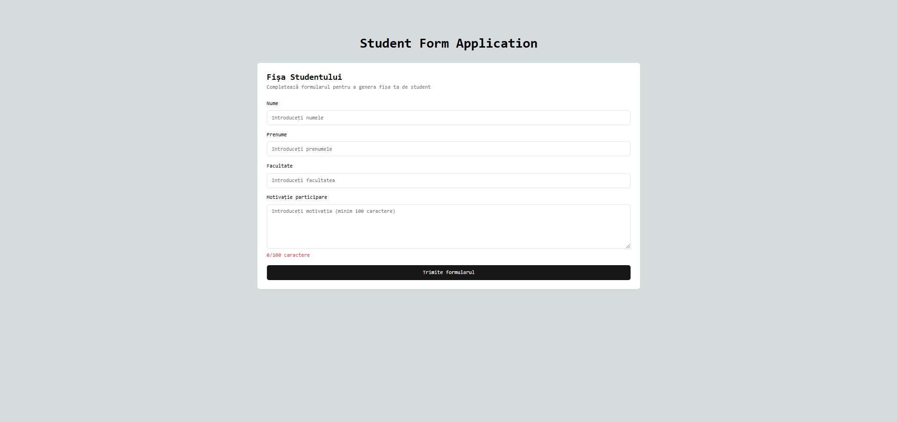
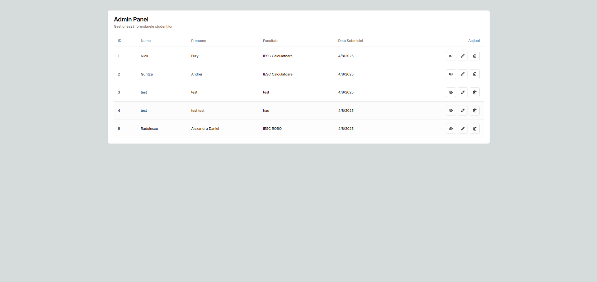

# Student Form Full-Stack Application

**Student Form Application** is a full-stack project that allows students to submit a form, which is then stored in a SQL Server database and automatically converted into a downloadable PDF. The application consists of a Next.js frontend and an ASP.NET Core backend, both containerized using Docker.

##  Features

-  Form submission with validation
-  Automatic PDF generation, downloadable by both user and admin
-  Admin panel with full CRUD functionality (no authentication)
-  Dockerized app with SQL Server
-  Unit tests (backend)

##  Tech Stack

| Layer       | Technology                         |
|-------------|-------------------------------------|
| Frontend    | Next.js, TypeScript, Tailwind CSS   |
| Backend     | ASP.NET Core 7.0 Web API            |
| Database    | SQL Server                          |
| PDF         | QuestPDF                            |
| Containers  | Docker, Docker Compose              |

## Project Structure

```
student-form-app/
│
├── backend/StudentFormAPI    # ASP.NET Core API
│   └── Controllers/
│   └── Services/
│   └── Models/
│   └── PdfGenerator/
│
├── frontend/                 # Next.js App
│   └── pages/
│   └── components/
│   └── styles/
│
├── docker-compose.yml        # Container orchestration
├── README.md
```

##  Quick Setup (with Docker)

1. **Clone the project:**
```bash
git clone <repo-url>
cd <...>
```

2. **Start containers:**
```bash
docker-compose up --build
```

3. **Access the app:**

- Frontend: `http://localhost:3000` & `http://localhost:3000/admin`
- API: `http://localhost:5000`
- SQL Server: runs inside a container, configured in `docker-compose.yml`

##  PDF Generation

- After form submission, a PDF is automatically generated with the provided data.
- The PDF is available for immediate download by the user.
- The admin can also download PDFs at any time from the admin panel.

##  Admin Panel

- Accessible via a dedicated route (e.g., `/admin`)
- Features:
  -  Full entry visualization
  -  Edit entries
  -  Delete entries
  -  Download PDF

> **Note:** No authentication – for internal use only at this moment.

##  Testing

### Backend (ASP.NET Core)

To run the tests:

```bash
cd backend
dotnet test
```

> Tests cover logic, validation, and PDF generation services.

## Screenshots
### Form page & Admin Page
<p align=center>
    
    
</p>

## 🌐 API Endpoints

###  Access Swagger UI

After running the backend, open: http://localhost:5000/swagger/index.html

###  Features:

- View all available endpoints
- See request/response formats
- Test endpoints directly in-browser
- Easily debug or explore the API

> Make sure the backend is running (`docker-compose up`) before accessing Swagger.

### The ASP.NET Core backend exposes the following endpoints:

###  `POST /api/form`

- **Description**: Submit the student form.
- **Request body**: JSON with student details
- **Response**: `200 OK` if successfully saved and PDF generated.
- **Notes**: Automatically triggers PDF creation after submission.

---

###  `GET /api/form`

- **Description**: Retrieve all submitted form entries.
- **Response**: JSON array with all submissions.
- **Access**: Open to all (no authentication).

---

###  `GET /api/form/{id}`

- **Description**: Retrieve a specific entry by ID.
- **Response**: JSON with the matching form data or `404 Not Found`.

---

###  `PUT /api/form/{id}`

- **Description**: Update a specific submission.
- **Request body**: JSON with updated data.
- **Response**: `200 OK` if the update is successful.

---

###  `DELETE /api/form/{id}`

- **Description**: Delete a specific submission.
- **Response**: `204 No Content` if deletion is successful.

---


##  Additional Notes

- This is an internal-use project for structured student data collection.
- Not yet deployed to any public server.
- No authentication is used, assuming a trusted internal environment.

##  Contributions

This is an internal project. For improvements:

1. Create a new branch
2. Make your changes
3. Submit a merge request (for private GitHub/GitLab repos)

##  License

This project is intended for internal use and has no public license attached.